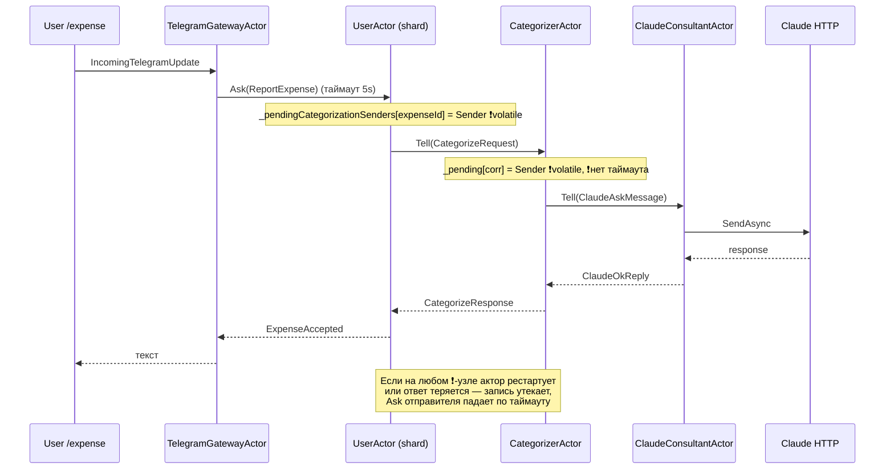

# Технический долг, рефакторинг и оптимизации FinanceBot

## Context

Кодовая база прошла 23 стадии и в целом дисциплинирована (CQRS/ES на Akka.NET,
строгий `TreatWarningsAsErrors`, value-objects, тесты на парсеры/домен). Но при
сквозном чтении ядра всплыли структурные риски корректности, несколько мёртвых
абстракций/зависимостей и точки оптимизации. Пользователь попросил **список тех-долга
с примерами реализации** и подтвердил: оформить отчёт **и сразу внести все правки**
(корректность + рефакторинг + оптимизации + чистка зависимостей + перф) одним PR.

Этот файл — и есть отчёт-каталог, и одновременно план реализации: для каждого пункта
указаны файл, суть проблемы и пример кода. Ниже — приоритезированный порядок работ
и план верификации.

---

## Сквозная структурная проблема: «volatile pending-reply maps»

Главный повторяющийся анти-паттерн: актор запоминает `Sender` входящего запроса в
обычном `Dictionary`, делает `Tell` дальше по цепочке, и отвечает исходному отправителю
только когда вернётся ответ. Карта **не персистится** и **не имеет таймаута**. При
рестарте актора (passivation/rebalance шардов/краш) или потере ответа запись утекает,
а пользовательский `Ask` падает по таймауту.



Точки: `UserActor._pendingCategorizationSenders` (UserActor.cs:257) и
`CategorizerActor._pending` (CategorizerActor.cs:22). Решения — в пунктах A2/A2'.

---

## A. Корректность и надёжность (критично)

### A1. Проекции не подтверждают init-handshake → read-model'и не наполняются
`src/FinanceBot.Application/Projections/ProjectionBase.cs:28-34, 71-79`

`Sink.ActorRefWithAck` требует, чтобы актор ответил `ackMessage` на `onInitMessage`,
и только потом стрим начинает слать элементы. В `ProjectionBase` зарегистрированы лишь
`Receive<StartProjection>`, `Receive<EventEnvelope>`, `Receive<ProjectionFailed>`. Нет
`Receive<ProjectionInit>` (и `ProjectionComplete`) — init уходит в unhandled, ack не
отправляется, **стрим стопорится и ни одно событие не доходит**. Следствие: пусты
`app.users`, `app.expenses`, `app.periods`, `app.incomes`, `app.whitelist`. Это рушит
`/report`, графики, и — через `IUserDirectory.ListAsync` — весь планировщик (вечерние
опросы, salary/advisor-тики, wakeup). Проекционных тестов нет (E1), поэтому не поймали.

Фикс — добавить два хендлера:

```csharp
Receive<ProjectionInit>(_ => Sender.Tell(new ProjectionAck()));
Receive<ProjectionComplete>(_ =>
    _log.Info("Projection {ProjectionName} stream completed.", ProjectionName));
```

Фикс безопасен в любом случае: если стрим и так работал — хендлеры безвредны.
Обязательно закрыть интеграционным тестом (E1), который доказывает наполнение read-model.

### A2. `UserActor._pendingCategorizationSenders` теряется при рестарте
`src/FinanceBot.Application/Actors/User/UserActor.cs:257, 292, 356`

Между `ExpenseReported` и приходом `CategorizeResponse` ссылка на `Sender` живёт только
в памяти. Passivation шарда/rebalance/краш в этом окне → пользователь не получает
`ExpenseAccepted`, `Ask` в gateway падает по таймауту (5s). Утечки записей при потере
`CategorizeResponse` тоже не очищаются.

Минимально-инвазивный фикс: после первой персистенции отвечать отправителю **сразу**
(трата принята), а категоризацию подтверждать отдельным уведомлением через EventStream/
gateway (как уже делается для inline-кнопок). Тогда reply не зависит от volatile-карты.
Если хотим сохранить «один ответ с категорией» — добавить `ReceiveTimeout`/таймер на
«осиротевшие» expenseId и слать fallback-ответ:

```csharp
// при постановке в ожидание:
Timers.StartSingleTimer(("cat", expenseId),
    new CategorizationDeadline(expenseId), TimeSpan.FromSeconds(30));

Command<CategorizationDeadline>(d =>
{
    if (_pendingCategorizationSenders.Remove(d.ExpenseId, out var p))
        p.Sender.Tell(new ExpenseAccepted(/* с Category.Other / needsReview=true */));
});
```

### A2′. `CategorizerActor._pending` без таймаута + мёртвый `AskTimeout`
`src/FinanceBot.Application/Actors/Categorizer/CategorizerActor.cs:18, 22, 100`

Объявлен `AskTimeout = 35s`, но он **нигде не используется** для Ask (актор шлёт `Tell`
и ждёт ответа вручную). Чтобы заглушить предупреждение об unused-поле под
`TreatWarningsAsErrors`, добавлен хак `private static readonly TimeSpan _ = AskTimeout;`
(строка 100). Если `ClaudeOkReply/Unavailable` не придёт — запись в `_pending` утекает
навсегда, и `UserActor` тоже зависает в ожидании `CategorizeResponse`.

Фикс: убрать хак и реально применить таймаут через таймер с корреляцией:

```csharp
// при добавлении в _pending:
Timers.StartSingleTimer(corr, new ClaudeDeadline(corr), AskTimeout);

Receive<ClaudeDeadline>(d =>
{
    if (_pending.Remove(d.CorrelationId, out var p))
        p.Sender.Tell(new CategorizeResponse(
            p.Request.CorrelationId, p.Request.UserId, p.Request.ExpenseId,
            Category.Other, ExpenseSource.Fallback, NeedsReview: true));
});
```
(добавить `IWithTimers` актору). Удалить строку 100 и заглушку `_`.

### A3. При регистрации таймзона = таймзона **сервера**
`src/FinanceBot.Application/Actors/Telegram/TelegramGatewayActor.Stage5.cs:206`

`new RegisterUser(userId, update.TelegramId, TimeZoneInfo.Local.Id)` — все юзеры
получают TZ хоста. Для финбота с per-user расписаниями (вечерний опрос, salary-день,
advisor) это неверный дефолт. Тот же серверный `TimeZoneInfo.Local` зашит в планировщике
(`SchedulerActor.cs:168`, `DispatchClaudeAutoRecoveryIfDue`) и в
`ClaudeConsultantActor.NextLocalHour` (Claude.../ClaudeConsultantActor.cs:107).

Фикс: задать явный дефолт (например `"Europe/Moscow"` из конфига) и подсказать юзеру
сменить через `/settings timezone`. Серверный `TimeZoneInfo.Local` для системных тиков
вынести в конфиг (`Scheduler:ServerTimezone`), чтобы поведение не зависело от хоста.

```csharp
var defaultTz = _options.DefaultUserTimezone ?? "Europe/Moscow";
var register = new RegisterUser(userId, update.TelegramId, defaultTz);
```

### A4. Миграции `app`-схемы стартуют **после** Akka
`src/FinanceBot.Host/Program.cs:33, 41`

`AddFinanceBotApplication` (→ `AddAkka`) регистрирует Akka-hosted-service раньше, чем
`DatabaseMigrationService` (строка 41). Hosted-сервисы стартуют в порядке регистрации,
значит акторы/проекции поднимаются до создания таблиц `app.*` → проекции ловят исключение
на `app.projection_offsets`, уходят в restart-loop до завершения миграции. Akka-схема не
страдает (`autoInitialize:true`), а вот read-model'и — да.

Фикс: зарегистрировать миграцию **до** `AddFinanceBotApplication`, чтобы её `StartAsync`
завершился раньше старта ActorSystem:

```csharp
builder.Services.AddFinanceBotInfrastructure(builder.Configuration);
builder.Services.AddHostedService<DatabaseMigrationService>(); // ← до AddAkka
builder.Services.AddFinanceBotApplication(builder.Configuration, ...);
```

### A5. Перекрытие тик-проверок в планировщике
`src/FinanceBot.Application/Actors/Scheduler/SchedulerActor.cs:66-79, 135-163`

`OnSystemTick` запускает `RunPeriodicTickCheckAsync(_lastCheckAt, now)` как fire-and-forget,
а `_lastCheckAt` обновляется только по приходу `TickCheckCompleted`. Если скан занял
> 1 минуты (много юзеров + HTTP к isdayoff), следующий тик стартует с тем же `_lastCheckAt`
→ часть тиков отправляется дважды.

Фикс: флаг «проверка в процессе» и пропуск тика, если предыдущий не завершён:

```csharp
private bool _tickInFlight;
// в OnSystemTick:
if (_tickInFlight) { _ = WriteHeartbeatAsync(now); return; }
_tickInFlight = true;
// в OnTickCheckCompleted/OnStartupCheckCompleted: _tickInFlight = false;
```

---

## B. Рефакторинг и чистота кода

### B1. `UserActor` — god-class (768 строк + 5 partials)
`src/FinanceBot.Application/Actors/User/UserActor.cs`

Регистрация, settings, доход/период/аллокация, расходы, категоризация, savings,
память — всё в одном акторе и одном `UserState`. После фикса A2 (ответ без volatile-карты)
вынести группы команд в partial-файлы по фиче (как уже сделано для Stage17-21) и сжать
`ApplyEvent`. Минимально: переместить `_pendingCategorizationSenders`-логику из ядра в
отдельный partial. Не переписывать всё разом — сфокусироваться на снижении связности
ядра, без новых абстракций.

### B2. Мёртвая абстракция `Money`
`src/FinanceBot.Domain/ValueObjects/Money.cs` + `Reports/ReportBuilder.cs:113`

Домен оперирует сырым `decimal`; `Money` (с currency-машинерией) используется только в
паре мест, а `ReportBuilder` даже **затеняет** тип приватным методом
`private static string Money(decimal v)` — путаница имён. Решение: либо принять `Money`
сквозь домен (большая работа, не сейчас), либо **удалить** value-object и его тесты, а
форматтер в `ReportBuilder` переименовать в `Fmt`. Рекомендация: удалить (YAGNI), т.к.
мультивалютность не заявлена.

```csharp
private static string Fmt(decimal v) => v.ToString("0.00", CultureInfo.InvariantCulture);
```

### B3. Кэшировать ActorRegistry-ссылки вместо `TryGet` в каждом хендлере
Многократно: `var registry = ActorRegistry.For(Context.System); registry.TryGet<...>()`
(UserActor.cs:309, TelegramGatewayActor.Stage5.cs:79/198/248, CategorizerActor.cs:44,
SchedulerActor.cs:110/145/172). Лучше резолвить нужные `IActorRef` один раз в `PreStart`
(или внедрять через Props), оставив `TryGet` только там, где зависимость опциональна на
старте. Уменьшает шум и микро-аллокации на горячем пути.

### B4. Полные имена типов вместо `using`
В `ApplicationServiceCollectionExtensions.cs`, `CategorizerActor`, `SchedulerActor` и др.
повсеместно `FinanceBot.Application.Actors.Claude.ClaudeConsultantActor...`. Заменить на
`using`-алиасы — чисто читабельность, нулевой риск.

---

## C. Производительность и оптимизация

### C1. `Ask` к AccessControl-singleton на **каждое** входящее сообщение
`src/FinanceBot.Application/Actors/Telegram/TelegramGatewayActor.Stage5.cs:89-94`

Каждый апдейт — сетевой round-trip к cluster-singleton (потенциально на другом узле).
Для текущего масштаба (личный бот) ок, но это узкое место. Дёшево: кэш решений в gateway
с коротким TTL (или сброс по `UserWhitelisted/UserRevoked` через EventStream). Уже есть
`WhitelistProjection` → можно читать read-model локально. Приоритет — низкий, делаем
кэш с TTL, без переусложнения.

```csharp
// gateway: Dictionary<long,(AccessDecision dec, DateTimeOffset exp)> _accessCache;
// при IsAllowed → если есть свежая запись, не дёргаем singleton.
```

### C2. Read-model writers: 2 round-trip'а на событие + новый DbContext
`src/FinanceBot.Infrastructure/Projections/ExpenseReadModelWriter.cs:11-56`
(аналогично Income/Period/Users/Whitelist writers)

`UpdateCategoryAsync` грузит сущность (`FindAsync`) и затем `SaveChanges` — два запроса.
Заменить на set-based `ExecuteUpdateAsync` (один round-trip, без загрузки/трекинга):

```csharp
await db.Expenses
    .Where(e => e.ExpenseId == expenseId)
    .ExecuteUpdateAsync(s => s
        .SetProperty(e => e.Category, newCategory.ToString())
        .SetProperty(e => e.Bucket, newBucket.ToString())
        .SetProperty(e => e.Source, source.ToWireName())
        .SetProperty(e => e.NeedsReview, needsReview), ct);
```

Для идемпотентного insert оставить `FindAsync`-проверку **или** ловить unique-violation
(`DbUpdateException` по PK) — это убирает лишний SELECT в норме. Поскольку проекция
back-pressured (по одному событию), узким местом это станет только на большом объёме —
но `ExecuteUpdate` бесплатно и стоит применить.

### C3. Планировщик: O(users) скан с возможными HTTP каждую минуту
`SchedulerActor.cs:151-219`, `IsDayOffWorkdayCalendar` (кэш per-node, безразмерный)

Сейчас приемлемо (мало юзеров, isdayoff-ответы кэшируются). На рост: (а) ограничить/
эвиктить кэш календаря по размеру; (б) не дёргать advisor-резолвер для всех юзеров каждую
минуту, а вести «следующий тик» на юзера. Помечаю как наблюдение; правка — лёгкая (эвикция
кэша), архитектурную часть не трогаем без потребности.

### C4. `ClaudeConsultantActor`: неограниченные «припаркованные» таски
`Claude/ClaudeConsultantActor.cs:54-70`

`_ = ExecuteAsync(...)` на каждый `ClaudeAskMessage`; конкурентность к API ограничена
семафором (3), но число ожидающих на семафоре тасок не ограничено (нет back-pressure по
мейлбоксу). Под всплеском — много припаркованных тасок. Фикс: `Stash` сообщений при
исчерпании семафора, либо отказ с `ClaudeUnavailableReply(reason=Overloaded)` при
превышении порога ожидания.

### C5. Prompt caching (где промпт большой)
Categorization-промпт крошечный (≈60 токенов) — под минимум кэша Sonnet (1024 ток.) не
попадает, кэшировать нечего. А вот advisor-промпт (`AdvicePromptBuilder`) крупнее: если
его системная часть стабильна, добавить `cache_control: {type:"ephemeral"}` на системный
блок в `ClaudeClient.BuildHttpRequest` (по флагу в `ClaudeRequest`) — экономия на повторах.
Приоритет — низкий, делаем только если advisor-промпт реально большой и частый.

---

## D. Зависимости и гигиена сборки

### D1. Объявленные, но неиспользуемые пакеты
`Directory.Packages.props`: `Anthropic.SDK 6.5.0` и `Microsoft.Extensions.Http.Resilience`
— нет ни одного `PackageReference` и ни одного `using`. `ClaudeClient` ходит в API руками
(HttpClient + System.Text.Json), резилиенс — собственный Polly-pipeline. Удалить мёртвые
`PackageVersion` (или, если планировался переход на SDK/стандартный resilience-handler, —
отдельная задача; сейчас просто чистим).

### D2. Рудиментарные transitive-пины на net10
`Directory.Packages.props`: `System.Net.Http 4.3.4`, `System.Text.RegularExpressions 4.3.1`
— это .NET Framework-эровые пакеты, на net10 они часть рантайма; пины бессмысленны.
Проверить, что после удаления `dotnet restore`/`build` не тянет уязвимую транзитивку
(для того и стоит `CentralPackageTransitivePinningEnabled`), и убрать.

### D3. Модель Claude
`ClaudeOptions.cs:9` и `appsettings.json:21` — `claude-sonnet-4-5`. Рабочая, но можно
обновить на актуальную Sonnet. Низкий приоритет, через конфиг.

---

## E. Пробелы в тестах

### E1. Нет тестов проекций (это и пропустило A1/A4)
`Testcontainers.PostgreSql 4.1.0` уже в пакетах. Добавить интеграционный тест: поднять
Postgres-контейнер, прогнать миграции, записать события в журнал Akka, поднять одну
проекцию и убедиться, что read-model наполняется и offset двигается. Этот тест должен
**падать** на текущем `ProjectionBase` и **проходить** после фикса A1.

### E2. Нет тестов на writers/ReportBuilder/диспетч планировщика
Покрыть `ExpenseReadModelWriter` (идемпотентность insert, `ExecuteUpdate`), `ReportBuilder`
(агрегация по бакетам/категориям, сравнение периодов) и `SchedulerActor.DispatchDueTicks`
(окна тиков, защита от перекрытия из A5).

---

## Порядок реализации (один PR)

1. **A1** + **E1** — фикс handshake проекций и интеграционный тест-доказательство.
2. **A4** — порядок миграций до Akka.
3. **A2 / A2′** — таймауты и устранение volatile-зависимости в ответах; убрать хак `_`.
4. **A3** — дефолтная TZ из конфига вместо серверной.
5. **A5** — guard от перекрытия тиков.
6. **C2** — `ExecuteUpdate` в writers (+ тесты E2).
7. **D1 / D2 / D3** — чистка пакетов и модели.
8. **B2** — удалить `Money`, переименовать форматтер в `ReportBuilder` (+ убрать тесты Money).
9. **C4** — back-pressure/stash в ClaudeConsultant.
10. **B3 / B4 / B1** — кэш ссылок, `using`-алиасы, лёгкая декомпозиция `UserActor`.
11. **C1 / C3 / C5** — кэш доступа с TTL, эвикция кэша календаря, опц. prompt caching.

Каждый шаг — отдельный коммит, сборка зелёная (`TreatWarningsAsErrors=true`) после каждого.

## Верификация

- `dotnet build` (warnings-as-errors) и `dotnet test` после каждого коммита.
- **E1**: новый Testcontainers-тест проекции — красный до A1, зелёный после.
- **A4**: запуск против чистой БД (Testcontainers/локальный Postgres) — нет restart-loop
  проекций на старте, read-model'и наполняются.
- **A2/A2′**: юнит-тест с TestKit — при «молчащем» Claude/categorizer отправитель получает
  fallback-ответ в пределах таймаута, `_pending`/`_pendingCategorizationSenders` пустеют.
- **A3**: после `/start` у юзера TZ из конфига; `/settings timezone` меняет её.
- **A5**: тест с искусственно «долгим» сканом — тики не дублируются.
- **C2**: тест writer'а подтверждает single-round-trip update и идемпотентный insert.
- **D1/D2**: `dotnet restore` + `dotnet list package --vulnerable --include-transitive`
  не показывает регрессий после удаления пинов.
- Ручной прогон бота (polling, stub-токен допустим): `/income`, `/expense`, `/report`,
  `/advice`, графики — отрабатывают, read-model'и видны в БД.